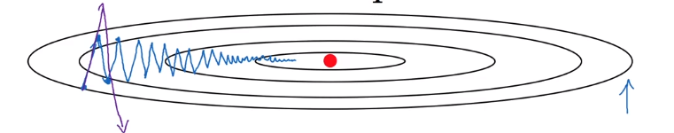

## Momentum

阻碍模型收敛的一个最大问题是，其迭代的方向总是和最小值不一样，就是所谓的震荡效应。

一个简单的解决办法是，我们把上一次迭代方向和下次迭代方向平均一下，这样子就能消除震荡的部分。我们可以用指数平均去保存更久远的迭代方向, 假设我们要优化的参数是 $W$, 那么我们有:
$$
V_{dW} = \beta V_{dW} + (1-\beta)dW\quad (指数平均)\\
W = W - \alpha V_{dW} \quad(更新参数)
$$

## RMSporp

全称是 Root Mean Prop. 这个的基本思想是，如果一个迭代方向的历史一直偏大，说明这有一定的问题，我们需要减小这样的迭代方向的步长大小。

我们要计算：
$$
S_{dW} = \beta S_{dW} + (1-\beta)dW^2 \\
W = W - \alpha \frac{dW}{\sqrt{S_{dW}} + \epsilon}
$$
$\epsilon$ 在分母防止除以 0

## Adam

Adam 的想法是把 Momentum 和 RMSprop 整合起来:

$$
V_{dW} = \beta_1 V_{dW} + (1-\beta_1)dW\quad (指数平均)\\
S_{dW} = \beta_2 S_{dW} + (1-\beta_2)dW^2 (RMSprop)\\
V_{dW}^{corrected} = \frac{V_{dW}}{1-\beta_1^t} (无偏估计)\\
S_{dW}^{corrected} = \frac{S_{dW}}{1-\beta_2^t} (无偏估计)\\

W=W-\alpha\frac{V_{dW}^{corrected}}{\sqrt{S_{dW}^{corrected}} + \epsilon}
$$

